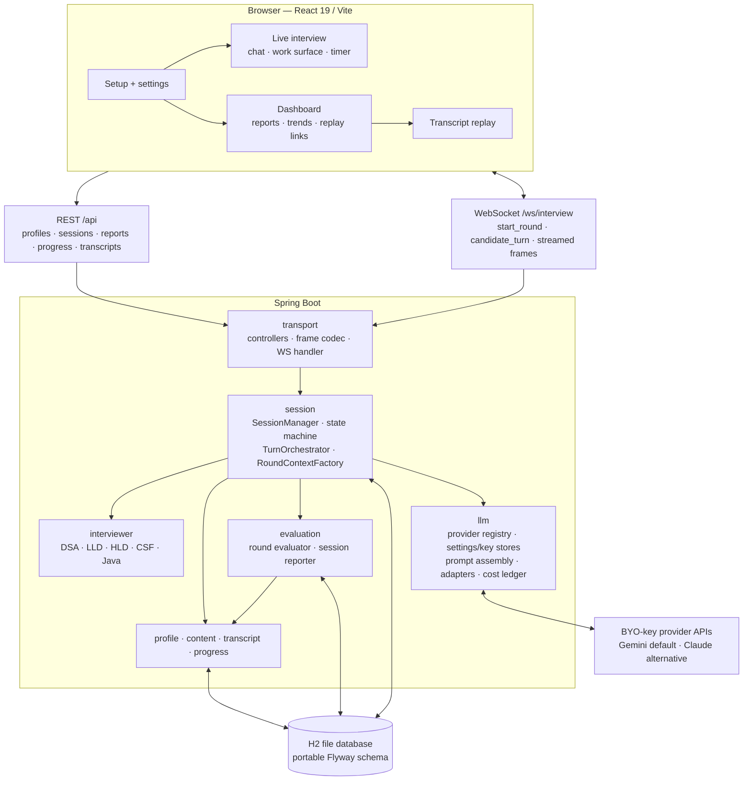
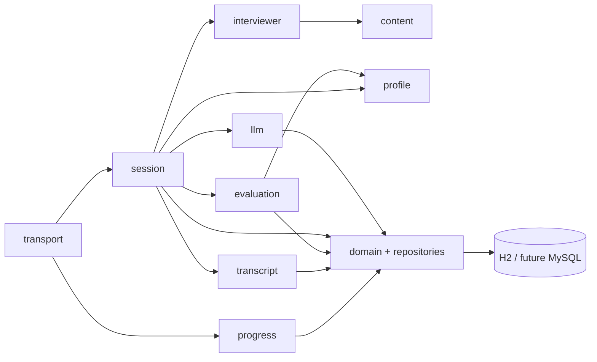
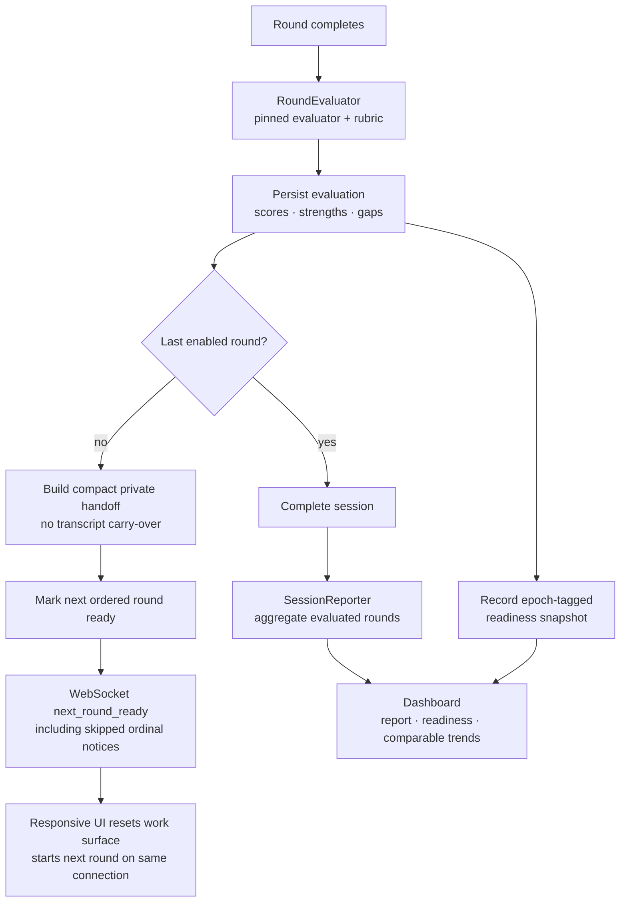

# sde-interview-loop — Project Plan

**Status:** approved and in active development. Phases 1–5 complete; Phase 6 and Phase 7 are implemented through their core user flows and are being hardened.
**Target:** SDE-2 backend, ~2 years experience, India product companies.
**Plan last updated:** 2026-08-29

> This document is the source of truth for **architecture, data model, and roadmap**.
> For what is actually built right now, the invariants that break silently, and how to
> work in this repo, read **`CLAUDE.md` first** — it is written for an agent picking the
> project up cold.

---

## 0. Where the project actually stands

**The app works end to end.** A round can be started in the browser, conducted by an AI
interviewer against a real LLM, and scored into a report when it ends.

| Phase | Scope | State |
|---|---|---|
| 0 | Spike | skipped — folded into Phase 1, measured live instead of as throwaway code |
| 1 | Foundations: domain, persistence, WS transport, LLM SPI, prompt assembly, cost ledger | **done** |
| 2 | DSA module | **done** |
| 3 | LLD module | **done** |
| 4 | HLD module + design graph surface | **done** |
| 5 | CS fundamentals + Java deep-dive modules | **done** |
| 6 | Company-calibrated full loop (round chaining) | **implemented** — ordered rounds, evaluator handoff, disabled-round notices, responsive transition UI |
| 7 | Evaluation, reports, dashboard, replay | **implemented** — per-round evaluation, session reports, readiness rollups/trends, dashboard and replay entry points |
| 8 | Voice mode | not started |
| 9 | Polish and hardening | not started |

Beyond the plan as originally written, two things were added that it did not anticipate:

- **Runtime provider switching and UI-supplied API keys.** Adapters were originally
  startup-time beans built from env vars, which meant a key pasted after boot could never
  be used. Now `ProviderFactory` builds a client per call from `ProviderKeyStore`, and
  `AppSettingsStore` holds the interviewer/evaluator bindings, both changeable from the
  settings UI without a restart. Changing the evaluator requires explicit confirmation
  because it starts a new comparability epoch (§1.5).
- **A silent-turn safety net.** See `CLAUDE.md` — models pause after tool calls waiting
  for a function response that this app never sends, so a turn could reach the candidate
  as literal silence. Handled in both prompt text and `TurnOrchestrator`.

### Data that already existed before any code

- **`company-profiles/`** — 11 profiles, a JSON Schema, and a README. All validate
  clean. All still carry `calibration.confidence: seeded-unverified` — correcting them
  from real interview data remains the highest-value thing the owner can do, and nothing
  blocks it.
- **`config/providers.yaml`** — the multi-provider LLM and voice configuration from
  DM-5/DM-1. Gemini and Claude have working adapters; OpenAI and DeepSeek remain stubbed
  with `<set-me>` model IDs and no adapter. Model IDs are left blank rather than guessed,
  since vendor IDs change often and a wrong one fails at runtime.
- **`question-bank/`** — added during Phases 2–5. All content is original prose written
  for this project (see D-5, now resolved).

**Level calibration.** Everything is pitched at the SDE-2 bar. Three entries in the
seed table named levels above SDE-2 and have been retargeted, with a `LEVEL NOTE` in
each file recording the change:

| Company | Seed table said | Retargeted to |
|---|---|---|
| LinkedIn | Sr. SWE | SWE (non-senior) — senior-only architecture round disabled |
| Walmart Global Tech | SWE-4 / Sr | SWE-3 |
| Apple | ICT3 / ICT4 | ICT3 |

Google L4 is the only profile that keeps a `hard` difficulty target (its DSA rounds);
every other loop peaks at `medium-hard`. Readiness bar is `hire` everywhere — no
profile demands `strong-hire`, which would be a senior-loop expectation.

---

## 1. Architecture

### 1.1 Shape

A single-user, locally-hosted, two-process system. No auth, no tenancy, no cloud
deployment. The design constraint that matters most is not scale — it is **your laptop's
16GB** and **your LLM API bill**.

```
┌─────────────────────────────────────────────────────────────────┐
│  Browser (React 19 + Vite)                                      │
│  chat pane │ Monaco editor │ diagram canvas │ report/settings   │
└────────────┬──────────────────────────────┬─────────────────────┘
             │ WebSocket (interview turns)  │ REST (setup, history, reports)
┌────────────▼──────────────────────────────▼─────────────────────┐
│  Spring Boot 3.4                                                │
│                                                                 │
│  transport ──► session (state machine) ──► interviewer modules  │
│                     │                       dsa lld hld csf java│
│                     │                          ▼                │
│                     │                    llm (provider SPI)     │
│                     │                     · adapters: gemini,   │
│                     │                       claude              │
│                     │                     · key + settings store│
│                     │                     · prompt assembly     │
│                     │                     · streaming           │
│                     │                     · cost ledger         │
│                     ▼                                           │
│         transcript · evaluation · content · profile             │
└────────────┬────────────────────────────────────────────────────┘
             │ JDBC (portable SQL — no vendor-specific types)
      ┌──────▼───────┐
      │  H2 (file)   │  sessions · transcripts · artifacts · signals · reports
      └──────────────┘  swappable for MySQL/Postgres via datasource config
```

Two processes: `app` and `web` (Vite dev server in development; static files served by
the app in the packaged build). No database container — H2 runs embedded in the JVM,
writing to a local file. Budget roughly 1.5GB total, which leaves real headroom alongside
IntelliJ.

**Docker is now optional (A-3).** `docker` is not available in this WSL2 distro, and once
DM-6 removed the database container the only things left to containerise were a Spring
Boot jar and a Vite dev server — both of which run natively with `mvn spring-boot:run` and
`npm run dev`. Containerising them buys nothing for a single-user local app and costs RAM
on a 16GB box. Compose remains a nice-to-have for packaging, not a prerequisite; enable
Docker Desktop's WSL integration for this distro only if you want it.

### 1.1a Current component architecture



### 1.1b Package ownership and persistence boundaries



`RoundContextFactory` is the intentional transaction boundary: it reads the lazy domain
graph and returns a detached `RoundContext`; provider streaming then runs without holding
a database connection. Entities with lazy parent links never cross the JSON boundary.

### 1.2 The core idea: the interviewer is a state machine, not a chatbot

A free-form chat with a system prompt will drift. It forgets to ask about complexity,
lets you off the hook, and runs long. Each round is therefore an explicit phase machine,
and the model is told which phase it is in:

```
DSA:   BRIEFING → CLARIFYING → APPROACH → CODING → COMPLEXITY → EDGE_CASES → FOLLOW_UP → WRAP
LLD:   BRIEFING → REQUIREMENTS → CLASS_MODEL → DEEP_DIVE → EXTENSION → WRAP
HLD:   BRIEFING → REQUIREMENTS → ESTIMATION → HIGH_LEVEL → DEEP_DIVE → BOTTLENECK → WRAP
CSF:   rapid-fire; adaptive topic walk, depth tracked per topic
JAVA:  SCENARIO → PROBE → DEPTH_LADDER → TRADE_OFF → WRAP
```

Phase transitions are driven by the model but *enforced* by the backend: the interviewer
returns a structured control block alongside its prose, and the backend decides whether
to honour it. This is what stops the AI from skipping complexity analysis because you
sounded confident.

### 1.3 Turn loop

Per candidate turn:

1. Client sends a turn over WebSocket: chat text, plus the current editor buffer or
   diagram graph if they changed since the last turn.
2. Backend assembles the request in **cache-stable order** (§1.4).
3. Provider call (Gemini by default), streamed token-by-token back over the same socket.
4. Model returns prose **and** tool calls: `record_signal`, `advance_phase`,
   `set_hint_level`, `end_round`.
5. Backend persists the turn, applies or rejects the control calls, updates round state.

Structured control via tool use — rather than parsing prose — is what makes the
evaluation incremental. Signals accrue during the round, so the end-of-round report is a
cheap summarisation of already-collected evidence rather than a second full pass over
the transcript.

Implemented in `session/TurnOrchestrator`. Two things learned in implementation that the
original plan did not anticipate, both now load-bearing:

- **Streaming runs outside any transaction.** A slow provider must not hold a database
  connection for the length of a model response, so `RoundContextFactory` materialises a
  detached `RoundContext` inside a read-only transaction first.
- **A turn with tool calls but no prose has to be repaired.** Function-calling protocol
  trains models to stop after a tool call and await a function response; these control
  tools never send one, so the candidate would experience silence. The orchestrator
  detects this and retries once with tools withheld.

### 1.3a Live-round sequence

```mermaid
sequenceDiagram
  participant C as React client
  participant W as WebSocket handler
  participant O as TurnOrchestrator
  participant S as Session state machine
  participant P as LLM provider
  participant D as H2 persistence

  C->>W: candidate_turn(text, artifact)
  W-->>C: turn_ack
  W->>O: handleCandidateTurn
  O->>D: persist candidate turn + artifact
  O->>O: build detached context; assemble stable → volatile prompt
  O->>P: stream request
  loop streamed interviewer response
    P-->>O: text delta / tool call / usage
    O-->>C: text_delta / tool_call
  end
  O->>D: persist interviewer prose
  O->>S: validate requested phase/hint/end controls
  S->>D: persist accepted state only
  alt tool calls without spoken words
    O->>P: one continuation request, tools withheld
    P-->>O: spoken continuation
  end
  O->>D: record cost ledger
  O-->>C: usage + turn_complete
```

### 1.3b Full-loop advancement and readiness flow



### 1.4 Prompt assembly and caching

Cache hits are the single biggest cost lever, and caching is prefix-based: any byte
change invalidates everything after it. So the request is assembled strictly
stable-to-volatile:

```
[ tools           ]  fixed per module                    ─┐
[ system: rubric  ]  versioned rubric for the module      │ cached
[ system: persona ]  module persona + company quirks      │ prefix
[ system: problem ]  the question statement               ─┘ ← cache breakpoint
[ messages        ]  rolling transcript
[ latest artifact ]  editor buffer / diagram graph        ← volatile, always last
```

Two rules the implementation must not break: **no timestamps or per-request IDs in the
cached prefix**, and the code artifact goes *after* the last breakpoint, never inside the
system block. Verification is not optional — `usage.cache_read_input_tokens` gets logged
on every call, and a Phase 1 test asserts it is non-zero by the third turn of a round.

For long full-loop sessions, each round gets a **fresh context** seeded with a compact
carry-over brief (a few hundred tokens: what was covered, notable strengths and gaps) —
rather than accumulating a 4-hour transcript. This is both cheaper and closer to reality;
real interviewers do not have your previous round's transcript.

### 1.5 The AI layer: pluggable providers

Per your decision, the interviewer brain is **not hardwired to one vendor**. The `llm`
package exposes a provider SPI and ships adapters for Claude, OpenAI, Gemini, DeepSeek,
and anything else added later. You supply the keys; the app adds no service of its own
and imposes no cost beyond your own usage.

```java
interface LlmProvider {
    String id();                            // "anthropic" | "openai" | "google" | "deepseek"
    Capabilities capabilities();            // streaming, toolUse, promptCaching, vision
    Flux<LlmEvent> stream(LlmRequest req);  // normalised events: TEXT, TOOL_CALL, USAGE, DONE
}
```

- **Default provider is Google Gemini** (`gemini-3.7-flash`), for both interviewer and
  evaluator. Claude (`claude-opus-5`, via `com.anthropic:anthropic-java`) stays
  configured as an alternative interviewer. Note the separation: this is what the
  *product* calls at runtime. Development of this repo is done with Claude Code, which is
  tooling and has nothing to do with the app's provider config.
- **Adapters use each vendor's official SDK** — never an OpenAI-compatible shim pointed
  at a different vendor, which silently loses provider-specific features. Gemini's Java
  SDK coordinates should be confirmed when that adapter is built rather than assumed.
- **Keys are local and server-side only.** Read from `.env` / local config, never
  committed, never sent to the browser. A provider with no key present simply does not
  appear in the UI — no errors, no configuration ceremony.
- **Capability floor: streaming + tool use.** The phase machine (§1.2) is driven by
  structured control calls, so a provider without function calling gets a JSON-mode shim
  in its adapter and is flagged as degraded in the UI. This is enforced at the SPI
  boundary, so a weak provider cannot quietly break the interview structure.
- **Caching survives the abstraction, but the mechanisms genuinely differ.** The
  stable-prefix ordering in §1.4 pays off everywhere, yet Gemini's explicit context
  caching (TTL-based cached-content objects with a minimum token floor) is not shaped
  like Anthropic's inline breakpoints, and neither resembles an automatic prefix cache.
  Each adapter owns its own mechanism; the prompt *assembly order* is what stays
  identical. Do not assume a cache strategy tuned on one provider transfers.
- **Model IDs and prices live in `config/providers.yaml`,** not in code. Both change
  often; neither should require a rebuild.

**The comparability problem — the one real cost of going multi-provider.** Two providers
grading the same round will not produce the same numbers. If the brain changes between
sessions, your readiness trend measures *provider drift* as much as your own progress,
which quietly destroys the thing the dashboard exists to show.

The design response: **the interviewer floats, the evaluator is pinned.** Run any
provider you like as the interviewer — that variety is genuinely useful, since different
models push back differently. But the evaluator that produces rubric scores is pinned in
config to one provider/model, and `round_evaluation` records which one. Changing the
pinned evaluator starts a new *comparability epoch*, marked on the dashboard so a step
change in your scores is never mistaken for a step change in your ability.

### 1.6 Module boundaries

Package-by-feature under `com.premd.interviewloop`:

| Package | Responsibility | Depends on | State |
|---|---|---|---|
| `transport` | WS + REST controllers, frame codec | session | built |
| `session` | Round/session state machine, ordered full-loop advancement, turn orchestration | interviewer, profile, transcript, evaluation | built |
| `interviewer` | `InterviewerModule` SPI + control tools + 5 implementations | llm, content | built |
| `llm` | Provider SPI + adapters, key/settings stores, prompt assembly, cost ledger | — | built |
| `content` | Question banks, one subpackage per module (file-backed) | — | built |
| `evaluation` | Rubric scoring of a completed round | llm, interviewer | built |
| `progress` | Epoch-aware readiness rollup, trends, company readiness | evaluation, profile | built |
| `transcript` | Turn + artifact persistence, replay | — | built |
| `profile` | Profile loading, schema validation | — | built |
| `domain` | JPA entities, enums, repositories | — | built |

The important boundary is `interviewer`. The SPI as actually frozen is:

```java
public interface InterviewerModule {
    ModuleType moduleType();
    QuestionSelection selectQuestion(RoundContext ctx);
    String rubric();                          // stable, identical every round at a rubricVersion
    String rubricVersion();
    String persona(RoundContext ctx);         // stable; includes verbatim company quirk behaviours
    String problemBlock(RoundContext ctx);    // stable; last block before the cache breakpoint
    String phaseDirective(RoundContext ctx);  // VOLATILE; goes after the breakpoint
    String openingBrief(RoundContext ctx);
    default List<LlmRequest.Tool> tools();    // the standard four control tools
    default ArtifactKind artifactKind();      // CODE | DIAGRAM | SCRATCH
    default String artifactLanguage();
    default String artifactLabel();           // how the artifact is announced in the prompt
    default int maxResponseTokens();
}
```

**The method split is not cosmetic — it mirrors the cache-stable prompt layout in §1.4.**
Everything from `tools()` through `problemBlock()` is the cached prefix; `phaseDirective()`
is volatile and lands after the breakpoint. Folding phase or timing data into `persona()`
or `problemBlock()` destroys caching silently.

**The SPI is frozen.** All five modules implement it. New capabilities go in as `default`
methods (that is how `artifactLabel()` was added in Phase 4) — a new abstract method would
break all five at once.

Adding a module is purely additive: a question bank directory, a loader in `content/`, and
a `@Component` implementing the SPI. `ModuleRegistry` discovers it as a Spring bean.

---

## 2. Data model

**Embedded H2 in file mode, Flyway-migrated, written in portable SQL.**

Two rules keep the MySQL/Postgres door open at near-zero cost:

- **No vendor-specific column types.** Open-shaped data (rubric scores, diagram graphs)
  is stored as `TEXT` holding JSON and mapped in the application layer, not as Postgres
  `jsonb` or MySQL `JSON`. You give up in-database JSON querying — irrelevant here, since
  every one of these reads is "fetch the row, deserialise it".
- **Flyway migrations use ANSI SQL only.** Portable migrations mean the move to MySQL is
  a datasource URL, a dialect property, and a fresh migration run.

**One amendment to your instruction.** Use H2 in *file* mode (`jdbc:h2:file:./data/...`),
not `jdbc:h2:mem:`. Pure in-memory drops everything on restart, which would take the
progress dashboard, readiness trends, and transcript replay — three of your stated
requirements — with it. File mode keeps the zero-ops benefit you're after (no container,
no daemon, no credentials) while the data actually survives. Say the word if you'd rather
have `mem:` anyway for early phases.

```
interview_session
  id, mode(single_module|full_loop), company_profile_id, profile_content_hash,
  started_at, ended_at, status(active|completed|abandoned)

session_round
  id, session_id, ordinal, module_type, phase, status,
  interviewer_provider, interviewer_model,
  question_slug, question_content_hash, difficulty_target,
  planned_duration_sec, actual_duration_sec, started_at, ended_at

transcript_turn                 -- append-only, ordered; the replay source of truth
  id, round_id, ordinal, role(candidate|interviewer|system),
  content, content_type, created_at, latency_ms

artifact_snapshot               -- append-only; enables scrubbable replay
  id, round_id, turn_id, kind(code|class_model|diagram|scratch),
  language, payload(TEXT, JSON for diagram graphs), created_at

signal                          -- emitted DURING the round via tool use
  id, round_id, turn_id, rubric_dimension, score(1-5), confidence, evidence

round_evaluation
  id, round_id, rubric_version, evaluator_provider, evaluator_model,
  comparability_epoch, scores(TEXT/JSON), strengths, gaps,
  readiness_band, narrative_md

session_report
  id, session_id, overall_band, per_module(TEXT/JSON), narrative_md

readiness_snapshot              -- denormalised for the dashboard
  id, taken_at, module_type, company_profile_id, score, sample_size

llm_call                        -- cost + latency observability, per provider
  id, round_id, turn_id, provider, model, role(interviewer|evaluator|summariser),
  input_tokens, output_tokens, cache_read_tokens, cache_write_tokens,
  cost_estimate_usd, latency_ms
```

Two deliberate choices:

- **Questions live in files, not tables.** `question-bank/<module>/` is version-controlled
  YAML. Rounds store `question_slug` + `question_content_hash`, so a report always records
  which version of a question you actually faced, even after you edit it. Same pattern as
  `company-profiles/`. (Rubrics ended up in module code rather than files — see §3.)
- **`transcript_turn` and `artifact_snapshot` are append-only.** Replay works by
  re-playing events, and an edited transcript is worthless as an evaluation record.
- **Repository access via Spring Data JPA**, so the storage swap stays a configuration
  change rather than a rewrite.

`llm_call` exists from Phase 1, not as an afterthought. Cost is a first-class concern in
this project and it cannot be managed if it is not measured per round.

---

## 3. Rubrics and readiness

**Scale:** 1–5 per dimension. **Bands:** `no-hire (<2.5) · lean-hire (2.5–3.4) ·
hire (3.5–4.2) · strong-hire (>4.2)`.

Rubrics live in each module's `rubric()` method, versioned via `rubricVersion()` — not in
a separate `rubrics/` directory as originally planned. Keeping the rubric text next to the
persona and phase directives that must agree with it turned out to matter more than
file-backing it, and `round_evaluation.rubric_version` still records which version scored
any given round.

**The dimension strings below are a live contract, not documentation.** The model passes
them verbatim to `record_signal`, they are stored in `signal.rubric_dimension`, and
`RoundEvaluator` scores against them. Renaming one without bumping `rubricVersion()`
silently corrupts score comparability. Tests pin them deliberately.

| Module | Version | Dimensions |
|---|---|---|
| DSA | `dsa-v1` | `clarification`, `approach_optimality`, `correctness`, `complexity_analysis`, `edge_cases`, `communication`, `response_to_pushback` |
| LLD | `lld-v1` | `requirement_extraction`, `class_model`, `solid_adherence`, `extensibility`, `concurrency_handling`, `code_quality` |
| HLD | `hld-v1` | `requirements_scoping`, `capacity_estimation`, `component_design`, `trade_off_reasoning`, `bottleneck_identification`, `depth_on_probe` |
| CS fundamentals | `csf-v1` | `breadth`, `depth_on_probe`, `precision_of_language`, `honesty_at_boundary` |
| Java deep-dive | `java-v1` | `api_fluency`, `internals_depth`, `concurrency_correctness`, `framework_trade_offs`, `scenario_diagnosis` |

**Per-round evaluation is built** (`evaluation/RoundEvaluator`): after a round completes it
hands the pinned evaluator the signals accrued during the round plus the transcript, and
requires a structured `submit_evaluation` tool call back — a prose reply is discarded and
retried once, since an unstructured evaluation is unusable rather than merely untidy. The
readiness band is computed server-side from the mean score against the thresholds above,
not taken as a separate model judgement that could contradict its own numbers.

**Company readiness** = `emphasis`-weighted mean of module scores, recency-weighted
(older sessions decay), gated by `readiness.module_minimums` — one module below its floor
blocks "ready" regardless of the weighted average — and reported with a confidence level
driven by `min_sessions_for_confidence`.

**The honest limitation:** this measures you against a *model's* idea of each company's
bar, seeded by profiles I generated. It is a rehearsal instrument and a drift detector,
not a calibrated predictor. Phase 7 includes anti-inflation measures (fixed rubric text,
anchored few-shot examples at each band, evaluator separated from interviewer). None of
that makes the absolute numbers trustworthy — the *trend* is the trustworthy part.

---

## 4. Phased roadmap

### Completed phases — what actually shipped

**Phase 0 (spike) was skipped.** Its questions were answered against the real Phase 1
implementation instead of throwaway code. Two of the four exit criteria are still
genuinely unanswered and are worth closing at some point: there is **no cache-hit
measurement** (nothing has verified `cache_read_tokens` is non-zero by the third turn),
and **no provider-parity run** (the same round has never been run through Gemini and
Claude to compare judgement). Both are now easier, not harder, than they would have been
as a spike.

**Phase 1 — Foundations.** Portable Flyway schema on embedded H2, domain model, profile
loader with fail-fast schema validation, session state machine, transcript persistence, WS
transport, and the `llm` package: provider SPI, Gemini adapter (default) plus Claude
adapter, key discovery, capability gating, cache-stable prompt assembly, per-provider cost
ledger. Docker Compose was dropped as unnecessary (§1.1). `mvn -q validate` profile
validation was **never wired** — validation happens at application startup instead.

**Phase 2 — DSA module.** 5 original questions, 8-phase round, Monaco artifact surface.

**Phase 3 — LLD module.** 5 original design problems, 6-phase round, reuses the Monaco
surface (a class model is just Java; no new frontend needed).

**Phase 4 — HLD module.** 4 original problems, 7-phase round, and a new structured
node/edge `DiagramPane` on the frontend per DM-2. Added `artifactLabel()` to the SPI as a
`default` method so the prompt announces the graph format rather than assuming code.

**Phase 5 — CS fundamentals + Java deep-dive.** CSF runs 2 topic *packs* rendered once
into the stable prefix and walked adaptively by the model inside a single `RAPID_FIRE`
phase — swapping questions from the backend mid-round would invalidate prompt caching
every turn. Java deep-dive runs 6 production-failure scenarios with probe ladders. Brought
the first tests into the repo.

### Remaining work

**Phase 6 — Company-calibrated full loop.** *Core flow implemented.* Full-loop sessions
create profile-ordered rounds with their explicit difficulty targets; disabled v1 rounds
remain `SKIPPED`. Completion evaluates the round, creates a compact private strengths/gaps
handoff for the next enabled interviewer, and emits a `next_round_ready` WebSocket event.
The client resets its work surface and begins the next round on the same connection. The
remaining product work is break/resume policy and live-provider confirmation of an entire
multi-round loop without burning excessive quota.

**Phase 7 — Evaluation, reports, dashboard, replay.** *Core flow implemented.* Per-round
evaluation writes session reports once the final evaluation exists; readiness snapshots and
trend points retain their comparability epoch; the dashboard presents report, history,
module scores and trends, and links into replay. Remaining hardening: anchored examples to
reduce evaluator inflation and a browser-based replay/dashboard walkthrough.

**Phase 8 — Voice mode.** Not started. Mirrors the LLM layer: a `VoiceProvider` SPI with a
zero-key browser-native default and optional key-based upgrades. See **DM-1**.

**Phase 9 — Polish and hardening.** Not started. Cost controls (per-session ceiling with a
warning threshold — see D-7), graceful API failure handling mid-round, session recovery
after a disconnect, packaged single-command startup.

**Testing debt, cutting across everything.** The test suite now includes a Spring-backed,
scripted-provider integration test for orchestration, silent-turn repair, evaluation/report
creation, and full-loop handoff. Endpoint/browser integration coverage is still missing.

### What the parallelisation plan was for

```
Phase 1 ─┬─► Phase 2 (DSA) ──┬─► Phase 6 ─► Phase 7 ─► Phase 9
         ├─► Phase 3 (LLD) ──┤
         ├─► Phase 4 (HLD) ──┤
         └─► Phase 5 (CSF+Java)
                              Phase 8 (voice) — independent throughout
```

Phases 2–5 were genuinely independent — separate packages, separate question banks,
separate rubrics, one SPI frozen at the end of Phase 1 — and that held up: all four landed
without renegotiating the interface, and the one capability that had to be added
(`artifactLabel()`) went in as a `default` method without touching the others.

**That parallelism is now spent.** The next work is Phase 9 hardening and measured provider
validation.

---

## 5. Decisions

### 5.1 Made

| | Decision |
|---|---|
| **DM-1 Voice** | Browser-native default, pluggable upgrades — reasoning below |
| **DM-2 Diagrams** | Structured graph (nodes/edges as JSON) |
| **DM-3 Code execution** | No runner; interviewer must dry-run your code against a concrete input |
| **DM-4 Java version** | Java 17 |
| **DM-5 LLM providers** | Multi-provider SPI, bring-your-own keys, pinned evaluator |
| **DM-6 Storage** | Embedded H2 in **file** mode, portable SQL, MySQL-ready |
| **DM-7 Default provider** | **Google Gemini** (`gemini-3.7-flash`) for interviewer and evaluator; Claude available as an alternative |

**DM-1 — voice, decided as you asked.** Your constraints were "no extra cost" and
"bring my own key", which rules out the managed-vendor option I would otherwise have
leaned toward, and the 16GB budget already ruled out self-hosted Whisper. So: **Web
Speech API as the zero-key default**, behind a `VoiceProvider` SPI shaped exactly like
the LLM one. It costs nothing, needs no key, uses no RAM, and works on day one. Its
weaknesses are real — robotic TTS, no barge-in, and it mangles technical vocabulary — so
the SPI exists precisely so that a key you have *already supplied* can upgrade it
(OpenAI's speech endpoints, Gemini Live) without adding a vendor or a bill you didn't
already have. Start free, upgrade with a key you own, never a new subscription.

One thing to know rather than discover later: Chrome's Web Speech implementation sends
audio to Google's servers. It is "browser-native", not local.

**DM-7 — default provider is Gemini.** Set now, before any sessions exist, which is the
cheapest possible moment: the pinned evaluator defines the comparability epoch for every
readiness score that follows, and switching it after fifty sessions makes that history
hard to read. `gemini-3.7-flash` is Google's strongest current workhorse for coding and
agentic work, but it is a **preview** model as of 2026-08-22 — confirm your key has
access, and expect preview IDs to move. `gemini-3.6-flash` is the configured fallback.

Keep two things distinct: **the product calls Gemini; this repo is developed with Claude
Code.** They are unrelated, and conflating them would be an easy way to "fix" the config
in the wrong direction later.

This resolves what was D-8. It leaves one real consequence — the module prompts in
Phases 2–5 will be tuned against Gemini's behaviour, so adding a provider later means
re-checking the prompts against it, not just writing an adapter.

**DM-6 — storage.** Your call to skip Postgres for now is a good one: it removes a
container, ~512MB of RAM, and all connection/credential setup from a single-user local
app. The only change I made is file mode over `mem:` (reasoning in §2). The portability
rules there are what make "move to MySQL later" cheap rather than a migration project —
they cost nothing to follow now and a lot to retrofit.

**DM-3 note.** Starting without a sandbox is the right call, but be aware of what it
costs: an interviewer that cannot execute your code will occasionally accept something
that does not compile. The forced dry-run catches a good fraction. If it turns out to
miss too much in practice, a Judge0/Piston container remains a clean Phase 9 addition —
nothing in the design forecloses it.

### 5.2 Resolved since

**D-5 — Question bank sourcing. Resolved: original prose only.** LeetCode problem
statements are copyrighted; copying them into this repo would be a real licensing problem
even for personal use. Every question in `question-bank/` is therefore written originally
for this project — real-world framings (auth tokens, maintenance windows, CDN rollouts)
over textbook restatements. Standard algorithmic *patterns* are unavoidable and fine;
copied statement *text* is not.

Two practical notes for whoever extends the banks:
- Curated lists such as Striver's A2Z sheet are useful as **topic coverage checklists** —
  they are indexes of links into LeetCode/GfG, not a source of text to copy.
- Current coverage spans hashing, sliding window, intervals, heaps, greedy, binary search,
  trees, graphs (Dijkstra), backtracking, DP, and tries (11 questions). Remaining gaps
  worth filling: stack/monotonic-stack, union-find, and two-pointer patterns.

**D-8 — Which providers ship first. Resolved: Gemini, then Claude.** Both adapters are
built and both stream genuinely. OpenAI and DeepSeek remain configured-but-stubbed in
`config/providers.yaml` with no adapter; adding one is additive against the frozen SPI.

### 5.3 Still open

### D-6 — Behavioral rounds *(Phase 6)*
Google's Googleyness, Atlassian's Values, and Microsoft's AA round are in the profiles
but marked `enabled_in_v1: false` — behavioral was not in your module list. Atlassian's
Values round in particular can sink an otherwise strong loop. Options: leave skipped,
add a thin behavioral module in Phase 6, or make it a Phase 10.

Now more tractable than when first raised: adding a module is purely additive against the
frozen SPI, and four have been added since without incident.

### D-7 — Per-session cost ceiling *(Phase 9)*
A full 4-hour loop is many hundreds of streamed turns. `llm_call` records per-call cost,
so the data to decide this is being collected — but **no real $/round figure has been
measured yet**, partly because `config/providers.yaml` still has `<set-me>` for Gemini
pricing, so `cost_estimate_usd` currently computes as 0. Filling in real pricing is a
prerequisite to deciding whether the app enforces a hard ceiling, warns, or just reports.

A related practical limit surfaced during development, worth knowing before designing this:
the **Gemini free tier allows 20 requests/day per model**, which a couple of full rounds
will exhaust. Quota is per-model, so switching to `gemini-3.6-flash` provides a separate
bucket.

### D-9 — Persistence of UI-supplied API keys *(opened during Phase 1 rework)*
`ProviderKeyStore` holds keys pasted through the settings UI **in memory only** — they are
lost on restart, deliberately, because persisting a secret is a decision the owner should
make rather than something an agent quietly implements. Options: keep it as-is (env vars
are the durable path, the UI is for trying an alternative), encrypt at rest locally, or
write to a gitignored local file. Unresolved; the current behaviour is a safe default,
not a conclusion.

---

## 6. Stack decisions

As built: Java 17, Spring Boot 3.4.3, React 19 + Vite 7. Docker turned out to be
unnecessary once the database container was dropped (§1.1). The AI layer is a
multi-provider SPI with **Gemini** as the default and Claude as an alternative (DM-5,
DM-7). Other choices, none controversial:

| Choice | Instead of | Why |
|---|---|---|
| Raw WebSocket + JSON frames | STOMP | One client, one message shape; STOMP's broker semantics buy nothing here |
| Flyway (ANSI SQL) | Hibernate `ddl-auto` | Transcripts are records; schema changes must be reviewable — and portable SQL keeps MySQL one config change away |
| H2 file mode | H2 `mem:` / Postgres container | Zero ops and ~512MB saved vs. a DB container, but data survives restarts (DM-6) |
| Plain React state + hooks | Redux / Zustand / TanStack Query | The plan called for Zustand + TanStack Query; the app was built without either and has not needed them. One screen is live at a time and the socket owns most state. Revisit only if state handling actually starts hurting |
| Monaco | CodeMirror | You asked for it, and it is the IntelliJ-adjacent muscle memory |

---

## 7. Where to pick up

Ordered by value, for whoever works on this next.

**1. Use the thing.** All five modules work. The most valuable input now is the owner
actually sitting a round and reporting what feels wrong — prompt tuning against real
sessions cannot be done from the outside, and every module's prompts were tuned against
Gemini's behaviour on a handful of turns, not a full round.

**2. Correct the company profiles.** All 11 remain `seeded-unverified` — plausible
defaults, not facts. Replacing guesses with real round structures is the highest-value
thing only the owner can do, and it needs no code change.

**3. Close the Phase 0 measurements that were never taken.** Both are now cheap:
   - **Cache-hit verification.** Log/assert `cache_read_tokens` is non-zero by the third
     turn of a round. Prompt caching is the single biggest cost lever and nothing has ever
     confirmed it works — and per §1.4 it fails *silently*.
   - **Provider parity.** Run one round through Gemini and the same through Claude. This is
     what proves the SPI is a real abstraction, and gives a first read on how far apart
     their judgement is.

**4. Fill in real pricing in `config/providers.yaml`.** Gemini's entries are `<set-me>`, so
every `cost_estimate_usd` currently computes as 0 and the cost ledger — a first-class
concern in this design — is recording nothing useful. Prerequisite for D-7.

**5. Then harden the completed core flows:** test a full loop and dashboard in a browser,
then add recovery, cost ceilings and packaged startup from Phase 9.

**Testing debt is worth paying down alongside any of the above.** Endpoint/browser
integration coverage is still absent — see §4.

D-6, D-7 and D-9 remain open and none of them block the work above.
