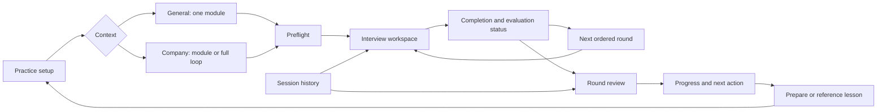

# UI/UX and content implementation plan

Prepared 2026-09-30 for the implementing agent selected by the owner (Opus 5.5).

## 0. Progress log

| Date | Increment | Status | Evidence |
|---|---|---|---|
| 2026-09-30 | Phase 0 harness (vitest + Playwright + scripted e2e backend) and Phase 2 P0 lifecycle fixes (send outcome, drafts, voice ownership, streaming finalisation, completion/evaluation states, private-scoring redaction, profile field normalisation) | Done for desktop; **mobile gate failing** | `docs/ui-ux/BASELINE.md`; RCA #14–#16 |

Remaining next: Phase 1 design tokens + responsive shell (fixes the mobile Send gate), baseline
screenshots, Phase 3 routes/refresh recovery, then Phases 4–8 as written below.

## 1. Purpose and evidence

Make SDE Interview Loop an excellent place to prepare, practise, review evidence, and improve.
Match the strongest interaction and teaching patterns in the owner's four learning apps while
preserving this product's main job: realistic SDE-2 backend mock interviews.

This is a **proposed implementation plan**, based on repository inspection, not a completed
redesign or a fresh browser usability audit. Findings below distinguish observed source behavior
from risks that need reproduction. No live LLM calls were made for this review. During this review,
`./mvnw -o compile` succeeded incrementally and `./mvnw -o test` passed 91 tests with zero failures,
errors or skips. This was not a clean rebuild or browser verification; implementers must record
their own verification after changes.

Reviewed baseline: `sde-interview-loop` at `ec3a205`, initially clean. Reference checkout snapshots:

| Reference | Local HEAD inspected | Relevant evidence | Adaptation here |
|---|---|---|---|
| HLD | `b3ab3fa` | `frontend/src/components/ModuleShell.tsx`; `content/CONTENT_SPEC.md`; README | URL-addressable views, retained panel state, understand/predict/explain learning loop, explicit assumptions |
| LLD | `8830d58` | `frontend/src/components/DesignDetails.jsx`, `RevealGate.jsx`, `AttemptComparison.jsx`; README | Requirements before solutions, explicit reveal, compare one's attempt, requirements/entities/patterns/trade-offs structure |
| DSA | `6bae4aa` | `frontend/src/AppRouter.jsx`; `docs/ui-revamp/EXPERIENCE_SPEC.md`; layout preference hooks | Return navigation, focused workbench, preserved drafts, diagram/source alternatives at narrow widths |
| CS Fundamentals | `ddeba3d` | `docs/DESIGN_SYSTEM.md`; `content/CONTENT_SPEC.md`; `frontend/src/components/TopicViewer.jsx` | Semantic themes, readable prose, progressive depth, misconceptions, interview recall, diagram accessibility |

The actual fourth folder is `../cs-fundamentals-with-ui-/`. These are local references; do not
depend on those folders at runtime. DSA's experience specification describes a proposed redesign;
do not present every feature in that document as already implemented. HLD's README also explicitly
identifies unfinished module views. A source comparison does not prove visual parity.

### Reading order

1. `AGENTS.md` in full, then this plan.
2. `RCA.md` before changing prompts, persistence, session state, or scoring.
3. `PROJECT_PLAN.md` sections 1–3 and 5; `docs/TASKS.md` H1–H6.
4. `docs/COMPLETION_PLAN.md` for broader resilience and delivery work.
5. Only the reference files needed for the assigned phase.

This plan owns the UI/UX and content sequence. It elaborates C1/C2/C5/C6/C7 in the older completion
plan, and depends on C3 recovery and C4 cost handling where indicated. It does not replace backend
invariants or authorize changing company calibration. Mark work done only with linked evidence.

## 2. What to preserve and what to improve

Already implemented: seven interviewer modules, company loops, general single-module practice,
streaming, artifacts, evaluation API, session reports, progress, replay, provider settings, resume
upload, and a browser voice foundation. Improve these flows incrementally.

| Source observation | User consequence / required work | Priority |
|---|---|---|
| `App.tsx` switches views in local React state | No durable page identity or refresh restoration; introduce routes and a rehydration contract | P0 |
| `Composer.tsx` clears text after calling a void `onSend`; `App.tsx` can reject a send | Draft can disappear on a connection race; reproduce and preserve unsent work | P0 |
| Streaming finalization only examines the last chat item, while tools/system messages are appended | Interleaved frames can leave earlier prose marked streaming; test turn identity and completion | P0 |
| `Composer.tsx` recognition callback replaces text using a captured prefix; stop can emit late results | Editing during dictation, sending, changing rounds, and unmounting need explicit lifecycle tests | P0 |
| `VoiceProvider.ts` stops recognition without detaching callbacks; TTS has no lifecycle feedback | Stale callbacks, speech/microphone overlap, and silent speech failures need handling | P0 |
| `TranscriptPane.tsx` renders raw tool arguments and prototype empty-state copy | Distracting implementation details and potential scoring hints appear during practice | P1 |
| `SetupView.tsx` still says full-loop chaining is future work | Product text contradicts actual behavior | P1 |
| `styles.css` has a dark-only base, many tiny labels, fixed-height shell, stacked mobile panes | Establish theme, typography, responsive workspace and zoom acceptance gates | P1 |
| `ReplayView.tsx` shows transcript and artifact payloads as text, including graphs | Review cannot easily connect an answer to its design/code or scoring evidence | P1 |
| `EvaluationController` exposes round scores/strengths/gaps; client focuses on session report | Build a dedicated round review using the existing endpoint first | P1 |
| Question selection uses random difficulty matching and fallbacks | Repeated questions and undisclosed actual difficulty undermine useful practice | P1 |
| `web/package.json` has no frontend test script | Add interaction coverage before changing session UX | P0 |
| `AGENTS.md` still says five modules, no voice, 38 tests | Reconcile documentation with code and new verification; do not repeat obsolete claims | P1 |

The intermittent update-depth warning and full-loop waiting gap in H1 are historical browser
findings, not newly reproduced here. Investigate them in Phase 0/2 before asserting a fix.

### Definition of excellent

- A new user understands the difference between general practice and a company loop immediately.
- Starting a prepared single-module mock takes at most three deliberate setup choices.
- Typing, navigation, resizing, voice controls, and reconnection preserve work.
- The candidate sees the question, the conversation, and their artifact without layout fighting.
- Every completed round offers evidence, an explanation of gaps, and a specific next practice.
- Scores explain their limitations, sample size, evaluator epoch, and company calibration.
- Technical content teaches reasoning with checked examples, rather than answer-pattern memorisation.

These are product targets to validate, not a claim that the application is already best-in-class.

## 3. Product boundaries and proposed information architecture

Stay local, single user, Java 17, H2 file mode, BYO provider keys, zero new paid services. Preserve
structured HLD graphs and the no-code-runner decision. Do not build four more simulator platforms
inside this application. Reference apps supply learning destinations and interaction patterns.

Proposed navigation: **Practice · Sessions · Progress · Prepare · Settings**. Practice is the
default landing destination. Prepare offers concise module guidance and links to relevant learning
material. It is separate from a scored live mock. General practice remains single-module only.

Proposed routes (new, not existing API promises):

| Route | Purpose |
|---|---|
| `/practice` | Context, module, difficulty and readiness checks |
| `/sessions` | Active and completed sessions, filters, resume/review |
| `/sessions/:sessionId/rounds/:roundId` | Live or resumed round; backend decides allowable state |
| `/rounds/:roundId/review` | Feedback, evidence, artifact and next steps |
| `/progress` | General/company context, module and epoch-aware trends |
| `/prepare/:moduleType` | Orientation, rubric explanation, general warm-up, learning links |
| `/settings` | Providers, evaluator confirmation, voice, appearance, resume |

Routes identify persisted entities; they do not imply automatic recovery until the backend can
rehydrate safely. Never trigger a new LLM opening just because a route mounted. Invalid IDs get
an explicit missing-session page with a safe return link. Preserve Back/Forward and new-tab links.

## 4. Visual and interaction specification

### Theme, colour, typography

Keep teal as the product accent. Introduce semantic CSS tokens for page/surface/raised/code
backgrounds, primary/body/secondary/muted text, borders, focus, and success/warning/error/info.
Implement light, dark and system themes; persist preference with guarded storage access. A storage
denial must not prevent app startup. Sync Monaco, graph SVG, Markdown diagrams and charts.

Starting palette to measure, not automatically approve: dark page `#0B1020`, surface `#111827`,
body `#DBE4F0`, primary `#F8FAFC`, muted `#AAB6C8`, accent `#2DD4BF`; light page `#F8FAFC`,
surface `#FFFFFF`, body `#334155`, primary `#0F172A`, muted `#475569`, accent `#0F766E`.
Define separate foreground tokens for accent-filled buttons. Verify actual foreground/background
pairs, including disabled, hover and selected states. Never use colour alone to convey a result.

Use 16px minimum primary body text, 16–18px interview prose, 1.55–1.7 line height, and 60–75ch
reading measure. Metadata may be 12–14px if legible; avoid tiny text for key instructions. Keep
code at a comfortable user-adjustable size. Use system/local font fallbacks; no network font
dependency required. Spacing scale: 4/8/12/16/24/32/48px; modest 8–12px radii and subtle borders.

Normal text contrast target: 4.5:1; large text and meaningful UI boundaries: 3:1. Interactive
controls should be at least 44px on touch layouts. Test focus indicators independently.

### Layout and accessibility

| Width | Workspace behavior |
|---|---|
| ≥1280px | Question summary above; conversation and artifact split with keyboard-resizable separator |
| 768–1279px | Split only when each pane remains useful; otherwise explicit Conversation / Workspace tabs |
| 320–767px | Single active pane; Question / Conversation / Workspace navigation; persistent turn/status context |

Use container fit rather than device assumptions. The mobile keyboard must not cover Send or trap
the last response. Use dynamic viewport units carefully; default document scrolling outside the
live workspace. Every long table/code block gets local scrolling, not page overflow. Switching
panes preserves draft, graph, scroll position and active turn. Hidden panes do not keep recording.

Provide one H1, skip link, meaningful landmark labels, keyboard tab navigation, Escape and focus
return for dialogs, text descriptions for diagrams, and reduced-motion support. Announce completed
messages and state changes politely; do not announce every streamed token. Never steal focus on
incoming text. Long names and 200% zoom must remain usable.

## 5. Ordered implementation phases

Every phase below requires a small commit with verification notes. Suggested paths marked NEW
are proposals. Keep `App.tsx` decomposition incremental; do not rewrite orchestration and visual
presentation together.

### Phase 0 — Establish the evidence and test harness (P0)

1. Re-read instructions, inspect worktree/history, run backend compile/tests and frontend checks.
2. Start the application with isolated test data and a scripted provider. Never use the owner's
   H2 file or real resume in automated browser runs.
3. Record screenshots and interaction notes at 375×812, 768×1024, 1366×768 and 1440×900 for setup,
   live DSA/HLD/CSF, settings, progress and replay; also inspect 320px and 200% zoom.
4. Add a frontend component test harness and browser smoke harness. Mock speech APIs and LLM
   traffic. Distinguish browser tests with intercepted API fixtures from real REST/WS integration.
5. Reproduce each P0 source risk above and historical H1 warnings; record fixtures before fixes.
6. Create NEW `docs/ui-ux/BASELINE.md` with actual findings and a checked/unchecked test matrix.

**Files:** `web/package.json`, `web/src/App.tsx`, `web/src/ws/`, existing scripted-provider test,
NEW `web/e2e/`, NEW `web/src/test/`. Existing backend tests currently allow open-in-view by default;
align test configuration with production so tests expose lazy-association mistakes.

**Gate:** one deterministic full-loop and one single-module browser scenario can run with zero
provider calls; console errors fail the check. Baseline screenshots exist before visual edits.

### Phase 1 — Design system and one polished reference screen (P1; depends on 0)

1. Build theme tokens, theme preference handling and shared Button/Field/Notice/Dialog/Tabs states.
2. Style setup as the reference screen in both themes; verify responsive and keyboard behavior.
3. Bring typography, spacing, focus and status language to all existing screens using the same tokens.
4. Integrate editor/graph colours, keeping layout geometry changes for Phase 4.
5. Record reference screenshots and token rules in NEW `docs/ui-ux/DESIGN_SYSTEM.md`.

**Files:** `web/src/styles.css`, `EditorPane.tsx`, `DiagramPane.tsx`, NEW `web/src/components/ui/`,
NEW theme hook. Use plain CSS/React unless a concrete requirement justifies a new dependency.

**Gate:** no essential text relies on low-contrast dim colours; light/dark/system work without
reload, storage denial is harmless, and the reference screen has no overflow at 320px.

### Phase 2 — Reliable turn, speech and completion lifecycle (P0; depends on 0)

1. Make submission outcomes explicit. Preserve drafts when send fails; mark sent vs acknowledged
   accurately. If retries are introduced, add server-recognised turn IDs and deduplication first.
2. Group deltas by round/turn identity. Finalize all message segments belonging to the completed
   turn even when control/system frames interleave. Ignore stale frames after navigation.
3. Disable concurrent submission while a reply is pending unless backend concurrency is deliberately
   supported. Replace “Send anyway” with a defined queue or unavailable explanation.
4. Model ending/evaluating/report-ready/evaluation-failed/next-round-ready as explicit UI states.
   Persist evaluation status server-side where needed; do not infer failure from a short timeout.
5. Fix voice callback ownership: cancel/detach on send, exit, round change and unmount; late results
   cannot overwrite a submitted or newer draft. Preserve manual edits and final transcript boundaries.
6. Stop read-aloud before listening, expose speaking/listening/error states and Stop playback.
   Add explicit locale selection, retryable permission errors and supported-browser fallback copy.
7. Guard local storage access for the read-aloud preference. Explain that browser speech recognition
   may send audio to its browser vendor; audio is not sent to this application backend. Earlier
   conversation claims that browser-native recognition is necessarily on-device were incorrect.

**Files:** `App.tsx`, `Composer.tsx`, `voice/VoiceProvider.ts`, `ws/frames.ts`, `useInterviewSocket.ts`,
`transport/InterviewWebSocketHandler.java`, `session/TurnOrchestrator.java` as required.

**Gate:** regression cases cover failed send, interleaved tools, delayed evaluation, duplicate
completion, switching round while recording, denied microphone and late recognition results.
Add RCA entries for reproduced defects. A browser mock does not verify physical microphone quality.

### Phase 3 — Practice setup, navigation and history (P1; depends on 1/2)

1. Add routes from section 3 with meaningful titles and normal links. Extract session coordination
   into focused hooks without changing server state-machine rules.
2. Give General practice and Company practice equal visible choices. Default first visit to general
   practice; persist subsequent selection safely. Company selection supports search and clear metadata.
3. Show seven module cards with purpose, surface, prerequisites and example skill. Resume explicitly
   requires upload; never expose personal resume text in setup summaries.
4. Get supported difficulty/availability from a backend capability response (NEW), not a universal
   four-option list. Display requested and actual difficulty when a bank fallback is allowed.
5. Preflight checks provider availability, required resume and module support without spending a
   paid verification request. Show full-loop order and skipped rounds before Start.
6. Add session history with context/module/status/date filters and clear Resume / Review actions.
   Restore transcript and artifacts from the server; never restart the interview on refresh.
7. Keep incomplete setup values when settings opens/closes. Replace stale prototype wording.

**Files:** `SetupView.tsx`, `App.tsx`, `api/client.ts`, `api/types.ts`, `ResumeSection.tsx`,
`SessionController.java`, `SessionManager.java`, NEW routes/session-history components.

**Gate:** new user can start general DSA, company HLD and resume practice without knowing IDs;
refresh and Back preserve context, and invalid full-loop/general requests remain rejected server-side.

### Phase 4 — Interview workspace and useful work surfaces (P1; depends on 1–3)

1. Add a candidate-safe question panel with requirements, examples and constraints. Create an
   explicit DTO; never serialize the question-bank object or `interviewer_notes` to the client.
   CSF/Java rounds reveal only the current prompt, not the whole private probe ladder.
2. Make conversational prose primary. Put safe connection/phase history in a collapsed details
   disclosure; keep private scoring signals out of live client frames, not merely CSS-hidden.
3. Render Markdown lists/tables/code consistently with raw HTML disabled and safe link handling.
   Incomplete streaming fences must not crash or repeatedly reflow the whole transcript.
4. Provide “Jump to latest” when the candidate scrolls up; preserve their position during streaming.
5. DSA/LLD/Java: editor font size, tab behavior, explicit attach status, undo-friendly reset with
   confirmation, and no Run button. Explain code is discussed/dry-run, not executed.
6. HLD: improve the structured graph editor with labeled edges, selection, rename/delete, undo/redo,
   fit/zoom, keyboard-operable node/edge forms and a readable text outline. Dragging is optional;
   semantic graph JSON remains authoritative. Validate dangling edges and duplicate IDs.
7. CSF/Behavioral/Resume: use a comfortable scratchpad; optional section prompts must not become
   canned answers. Do not show model solutions during an assessed attempt.
8. Apply the responsive layouts in section 4; keep destructive End round separate from Send.

**Files:** `InterviewView.tsx`, `TranscriptPane.tsx`, `EditorPane.tsx`, `DiagramPane.tsx`,
`PhaseStrip.tsx`, `StatusBar.tsx`, candidate DTO/controller (NEW as needed).

**Gate:** keyboard-only users can complete each surface; 30-turn transcript and a 20-node graph
stay usable; theme/view changes preserve every edit; no interviewer-only content in API/WS responses.

### Phase 5 — Evidence-based review and progress (P1; depends on 2–4)

1. Add a round-review API client for existing `GET /api/rounds/{roundId}/evaluation` and a dedicated
   review page. Lead with strengths, two or three priorities and rubric scores with descriptions.
2. Link quoted evidence to persisted transcript turns. Extend response DTOs with evidence references
   where absent; do not manufacture quotes or imply linkage from approximate text matching.
3. Render code and HLD graph snapshots in replay. Associate artifacts with turns explicitly when
   the schema supports it; otherwise label a timestamp-based selection as approximate.
4. Offer attempt → feedback → optional worked approach. Worked approaches are authored review
   material, not the private interviewer instructions or the sole acceptable answer.
5. Progress distinguishes general practice from company readiness; show sample counts, dates,
   rubric version and evaluator epoch. Do not visually join incomparable points as one trend.
6. Show missing modules and insufficient evidence without invented scores. Suggest one follow-up
   based on observed gaps using explainable rules before considering extra LLM calls.
7. Add learning-resource links from section 7 and explicit “Practise this skill again”.

**Files:** `ReplayView.tsx`, `DashboardView.tsx`, `EvaluationController.java`, `SessionReporter.java`,
`ReadinessCalculator.java`, `api/types.ts`, NEW review components and evidence DTOs.

**Gate:** an evaluated round leads to evidence and a relevant next action in two clicks; failed
evaluation still permits transcript review; empty/one-sample/multi-epoch histories are honest.

### Phase 6 — Content contract, correctness audit and exemplars (P0 content; depends on 0)

1. Inventory every bank item by module, skill, difficulty, estimated effort, example coverage,
   follow-up depth and source/provenance. Create NEW `docs/content/COVERAGE.md`.
2. Create NEW `question-bank/CONTENT_SPEC.md`. Define module-specific schemas, audience separation,
   evidence expectations, review material, version/hash changes and author checks (section 6).
3. Audit existing content before expansion. The Java transaction-self-invocation scenario describes
   an outer transactional method and another bean, then offers multiple ambiguous diagnoses; make
   invocation path, exception type, catch behavior and rollback observation internally consistent.
4. Audit LLD rate-limiter examples: a rolling-window assertion must not silently define token-bucket
   behavior. Specify refill/window assumptions and test boundary timestamps explicitly.
5. Review simplified networking/OS expected points in CSF, including HTTP status interpretations
   and stack-overflow scope. Verify technical claims against primary documentation at implementation
   time and record sources; these are review flags, not a completed external fact-check here.
6. Produce one excellent example per module. For Resume use wholly synthetic fixtures and a rubric
   guide, never fabricated candidate achievements or a file-backed question bank.
7. Add validators and focused fixtures for examples, metadata, disclosure boundaries and links.
   Preserve startup validation; add an offline content-check command documented for contributors.

**Files:** `question-bank/`, `content/<module>/` loaders under the Java root, module tests,
NEW `docs/content/`, NEW post-round review content directory (choose one documented location).

**Gate:** all existing bank items are audited or explicitly listed as pending; seven exemplars
pass editorial and technical review. Do not mass-generate more content until these exemplars pass.

### Phase 7 — Curriculum breadth and practice selection (P1; depends on 5/6)

1. Expand by missing skill family and reviewed examples, using section 6's proposed targets.
2. Add recent-question avoidance at selection time with a deterministic test seed; pin the selected
   question and version/hash once per round. Never change the stable problem block mid-round.
3. Report exhausted pools and actual difficulty honestly. Deliberate replay of a known item is
   allowed but labeled repeat practice; it must not imply unseen-problem readiness.
4. Keep CSF packs stable for a round; adaptation remains model-led within the pinned pack.
5. Add focused preparation pages and reviewed external-learning mappings. No runtime dependency on
   reference app availability; unavailable links do not prevent a mock.

**Gate:** no avoidable repeats until the matching pool is exhausted; requested/actual difficulty
is visible; every released item has checked examples, probes and useful review guidance.

### Phase 8 — Release audit and documentation (P1; depends on all core phases)

1. Run the release matrix in section 8 against the real local app with scripted provider traffic.
2. Compare reference screenshots and verify layout with long titles, long answers and sparse data.
3. Lazy-load Monaco and heavy review/diagram renderers; verify setup and scratch-only flows do not
   eagerly download the full editor. Record bundle and interaction measurements before/after.
4. Reconcile README, AGENTS status counts, TASKS and both plans; add the final flow/architecture
   diagrams to README. Label optional work and unverified browser/provider behavior explicitly.
5. Commit coherent increments, inspect diffs for personal data, and follow the owner's current
   push/merge instructions. Do not mark the entire project complete from a polished setup screen.

**Gate:** release evidence links each acceptance criterion to a test or recorded manual check;
no P0 failures remain. If hardware voice testing is unavailable, record that as an open gate.

## 6. Content quality standard and coverage targets

Candidate-facing orientation should explain the problem, necessary vocabulary, constraints,
expected deliverable and one concrete example. Preparation adds mental model, mechanism,
worked example, alternatives, failure modes, misconceptions and self-check questions. Review
adds evidence, trade-offs and next practice. Long-form content uses progressive disclosure and
appropriate diagrams, not a mandatory line count or decorative diagram quota.

Private interviewer material includes expected reasoning, acceptable alternatives, hint ladder,
counterexamples, follow-ups and rubric mapping. Keep it server-only, including hidden HTTP data.
Difficulty is SDE-2 challenge depth, not a company job-title ladder. A hard item remains bounded
and solvable/discussable within the planned round. Hints and prior exposure must be visible in review.

Proposed first-release targets below are planning goals, not current coverage claims. Ship batches
of 2–4 independently checked items. Quality and skill coverage take precedence over count.

| Module | Current bank | Initial target | Expansion priorities |
|---|---:|---:|---|
| DSA | 11 items | 24 | Two pointers, monotonic stack/queue, union-find, tree traversals, graph patterns, DP variants; explicit invariants and time/space derivations |
| LLD | 5 items | 12 | Booking/inventory, payment idempotency, scheduler lifecycle, extensible policies; concurrency and failure handling without pattern-name grading |
| HLD | 4 items | 10 | Notifications, file upload, job queue, webhook delivery, rate limiting, metrics; justified scale, failure analysis and consistency choices |
| Java deep-dive | 6 scenarios | 12 | Transaction boundaries, executor saturation, visibility, lifecycle, collections, resource leaks; symptom → hypothesis → experiment → fix |
| CSF | 2 packs | 6 focused packs | OS/concurrency, networking, databases, JVM, web/API, cross-domain diagnostics; retain existing mixed packs as appropriate |
| Behavioral | 5 items | 10 | Ownership, disagreement, ambiguity, prioritisation, incident communication, failure and learning; realistic scope for two years' experience |
| Resume | No bank | 1 guide + synthetic coverage fixtures | Ask for proof and trade-offs, detect unsupported inferences, handle absent/short resumes and mid-round re-upload |

Every item needs: original prose; explicit scope; version/provenance; hand-checked examples;
acceptable alternative approaches; realistic follow-ups; hint levels; rubric mapping; and a clear
boundary between public preparation, private evaluation and post-round explanation. New fields
require loader compatibility and tests before authored files use them. Do not feed review essays
into every prompt or enlarge cached prefixes unnecessarily.

Examples must state units and assumptions. HLD estimates should distinguish average/peak,
decimal/binary storage and illustrative latency from measured guarantees. LLD diagrams identify
ownership, interfaces and concurrency boundaries. DSA examples include duplicates/empty/limits
where applicable. CSF answers explain mechanism and limitations. Behavioral content teaches honest
specificity; never prescribe fake metrics or impressive stories.

Technical sources belong in authored metadata/review notes and should be primary references
(language/framework docs, standards, papers). Company claims remain seeded until the owner provides
evidence. Reading a lesson or revealing a solution is never counted as demonstrated interview mastery.

## 7. Linking the four learning apps

Add an optional, file-backed resource map keyed by module + skill tag. Proposed fields:
`resourceId`, `moduleType`, `skillTags`, `title`, `app`, `path`, `purpose`, `lastVerified`.
Resolve paths against a user-configured base URL per reference app. Do not hardcode ports from
another repo or assume its deployment exists. Validate route existence during authoring.

Examples of mapping intent: complexity/graph traversal → DSA; concurrency and object ownership
→ LLD; estimation/caching/failure trade-offs → HLD; transactions/networking/JVM → CS Fundamentals.
Use an explicit “Study this concept” link after review and in Prepare. Links are optional and must
not transmit resume content, transcripts, keys or score evidence in URLs. Respect the distinction
between a suggested topic and a verified exact deep link.

## 8. Acceptance and verification matrix

| Area | Required scenarios | Evidence |
|---|---|---|
| Setup | General, company single, full loop, missing key, missing resume, unavailable difficulty, unknown profile | Component + REST + browser checks |
| Turn lifecycle | Success, send failure, reconnect, interleaved tools, tool-only continuation, old frames, duplicate submission | Scripted WS + component regression tests |
| Persistence | Reload/resume, server restart, missing session, draft storage denied, artifact edit while submitting | Real test DB/browser flows |
| Completion | Slow evaluator, failed evaluator, partial report, skipped next round, final round | Deterministic full-loop integration |
| Voice | Unsupported, permission denied, no speech, start/stop/restart, late results, edit/send/exit, TTS interruption | Mock API tests + explicit manual microphone/speaker check |
| Review | DSA code, HLD graph, CSF no artifact, missing evaluation, evidence unavailable, repeat attempt | Fixtures + browser flows |
| Progress | Zero/one/many samples, missing modules, changed evaluator epoch, general/company separation | Calculation tests + visual checks |
| Responsive | 320/375/768/1024/1366/1440px, short viewport, 200% zoom, mobile keyboard, long content | Screenshots and keyboard walkthrough |
| Accessibility | Focus, tab panels/dialogs, contrast, colour independence, completed-turn announcements, reduced motion | Automated checks plus manual keyboard/screen-reader sampling |
| Content | Counts, invalid YAML, expected examples, fallback difficulty, private-note exclusion, review links | Offline validator + module/DTO tests |
| Performance | Setup dependency load, long transcript, graph editing, streaming during typing | Production bundle report + repeatable browser measurements |

Keep performance measurements on the same machine/configuration. Proposed response target for
local UI interactions is within 200ms when no network call is required; record the workload and
measurements instead of claiming a score from a single machine. LLM response latency gets a clear
pending state and is measured separately. Avoid rendering updates for each keystroke in unrelated panes.

Existing commands: `./mvnw -o compile`, `./mvnw -o test`, and in `web/`, `npm run typecheck`,
`npm run build`. Use a clean backend compile when sources change. Add test/browser/content commands
in Phase 0/6 and document exact invocations; do not claim scripts exist before adding them.

Use isolated fixtures with synthetic personal data. Do not run several reference apps and test
backends concurrently on the 16GB laptop. Do not change real provider settings or burn quota to
validate layouts. A real-provider check is a separate, narrowly scoped acceptance step.

## 9. Scope decisions and stopping rules

Included: theme/accessibility, responsive workspace, voice reliability, setup/history, durable
navigation, review/progress, original question quality and breadth, optional study links.

Deferred: cloud deployment, accounts, collaborative interviewing, code execution, self-hosted
speech, paid voice services, leaderboards, public resume sharing and duplicating the reference
apps' simulators. Preserve single-module-only general practice unless the owner separately asks
for a neutral full loop.

Ask the owner before deciding a pause/timer policy, persistent API-key storage (D-9), budget
thresholds (D-7), company calibration upgrades or a new voice vendor. These do not block design
tokens, content audits or the initial mocked interaction work. Routine UI decisions use this plan.

## 10. Copy/paste handoff to the implementing agent

> Implement `docs/UI_UX_CONTENT_IMPLEMENTATION_PLAN.md` in order, using the current repository
> as the source of truth. Read AGENTS.md completely and preserve its invariants. Start with
> Phase 0, reproduce the listed P0 issues, and build one polished setup screen before migrating
> the workspace. Use the four sibling repositories as references only. Keep scored interviews
> separate from revealed solutions. Build tests with scripted providers and isolated data; do
> not use real LLM quota for UI testing. Complete small, verified increments with evidence and
> update the plan as each gate passes. Follow the owner's git instructions. Do not call a feature
> verified from compilation alone, and do not reopen established architectural decisions.

Suggested commit sequence: baseline/harness → lifecycle regressions and fixes → theme/setup →
routes/resume → workspace → review/progress → content exemplars → content batches → release audit.
Content audit can be performed between UI phases; keep each implementation increment bounded.
